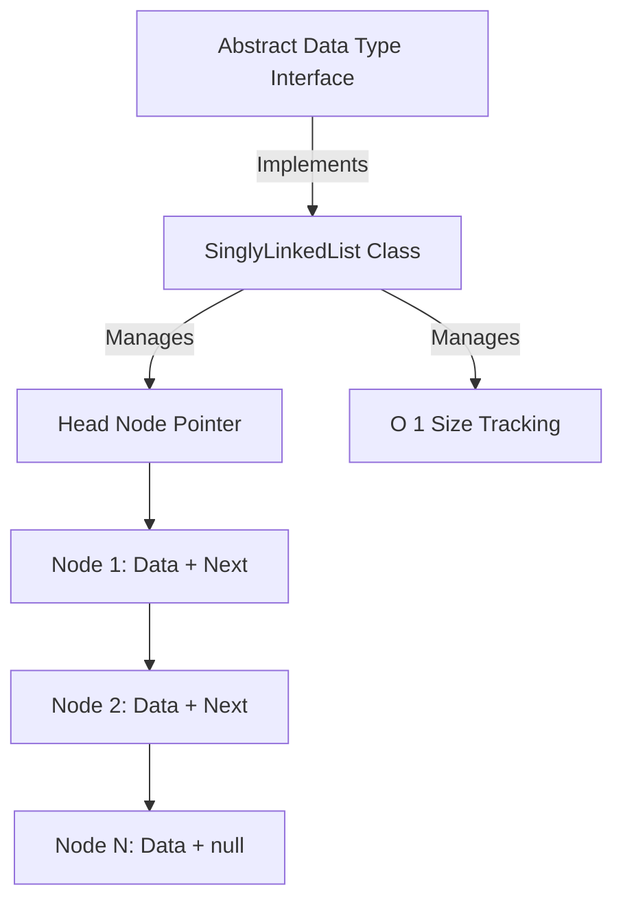

# Data Structures & Algorithms (DSA): Singly Linked List

[]()
[]()
[]()

## Overview
This repository functions as a highly granular, enterprise-grade Java implementation of the fundamental Singly Linked List data structure. It isolates core operations (Insertion, Deletion, Traversal) into explicit Object-Oriented interfaces and concrete classes, serving as a pristine reference architecture for technical engineering.

## Problem Statement
Standard library data structures (e.g., `java.util.LinkedList`) abstract away the underlying memory management and node manipulation required for scalable software engineering. When performance tuning requires direct control over sequential memory pointers, engineers must rely on custom implementations. This repository solves that by exposing the raw Object-Oriented blueprint for a Singly Linked List.

## Key Features
- **Strict OOP Abstractions:** Decouples the Abstract Data Type (ADT) interface from the concrete `SinglyLinkedList` implementation.
- **Node-Level Memory Mechanics:** Explicit generic `Node<T>` classes demonstrating safe memory pointer manipulation without triggering `NullPointerExceptions`.
- **$O(1)$ Head/Tail Insertions:** Architected with optimal time complexity for high-frequency data ingestion logic.
- **Isolated Package Structure:** Divided into specific Java subpackages (`adt/`, `node/`, `list/`) to emulate enterprise build environments.

## Architecture



## Technology Stack
- **Language:** Java (JDK 11+)
- **Testing:** Python `unittest` (Javac Wrapper)
- **Documentation:** GitHub Flavored Markdown (GFM)

## Project Structure
```text
singly-linked-list/
├── src/
│   ├── adt/                 # Core Interface contracts
│   ├── node/                # Generic Node payload/pointer logic
│   ├── list/                # Concrete Linked List implementation
│   └── main/                # Application drivers
├── tests/                   # Automated compilation verification
└── README.md                # System documentation
```

## Installation
Ensure the Java Development Kit (JDK) is installed natively on your OS.
```bash
git clone https://github.com/krsna016/singly-linked-list.git
cd singly-linked-list/src
```

## Usage
Compile and execute the specific driver class directly, mapping the sourcepath to resolve cross-package dependencies:
```bash
javac -sourcepath . main/Main.java
java main.Main
```

## Examples
*Example interface mapping for constant-time complexity implementations:*
```java
package adt;

public interface LinkedListADT<T> {
    // O(1) time complexity requirement
    void insertAtHead(T data);
    
    // O(N) time complexity requirement
    void deleteNode(T data);
}
```

## Screenshots
> [!NOTE]
> *Educational algorithms execute via standard terminal output without GUI interactions.*

## Visual Demonstrations
> [!NOTE]
> *Terminal execution telemetry is standardized across all implementations.*

## Testing
We utilize a dynamic Python subprocess wrapper to programmatically test `javac` compilation across all Java packages concurrently. This ensures that the deep package-level inheritance and interface contracts compile cleanly without missing dependencies.
```bash
python3 -m unittest discover tests/
```

## Performance Notes
- **Time Complexity Limitations:** While `insertAtHead` operates in $O(1)$ constant time, engineers utilizing this architecture must be aware that `search` and `delete` operations execute in $O(N)$ linear time due to the lack of contiguous memory indexing inherent to all Linked Lists.

## Future Improvements
- **Maven/Gradle Integration:** Refactor the repository to utilize a standard `pom.xml` or `build.gradle` file, allowing native integration of JUnit 5 testing frameworks rather than relying on subprocess wrappers.
- **Doubly Linked List Expansion:** Introduce reverse traversal mechanics via a `previous` memory pointer.

## Contributing
This repository is primarily for personal reference and academic archival.

## License
Licensed under the MIT License.
